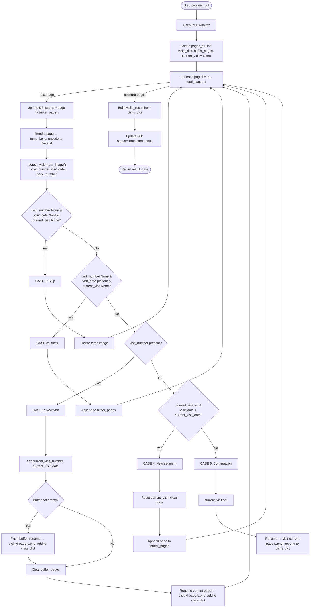

# process_pdf Flowchart

Flow for `PDFTextProcessor.process_pdf(id, file_path)` — splitting a PDF into visit-based page images using vision (Gemini/OpenAI) to detect Visit #, Visit Date, and Page # on each page.

## Case summary

| Case | Condition | Action |
|------|-----------|--------|
| **1** | `visit_number` and `visit_date` and `current_visit_number` all None | Skip page (delete temp image). |
| **2** | `visit_date` present, `visit_number` None, no current visit | Buffer page (wait for a page that has visit number). |
| **3** | `visit_number` present | Start/continue that visit: flush buffer into this visit, save current page as visit-N-page-L.png, add to `visits_dict`. |
| **4** | No visit number, current visit set, but `visit_date` is different from current | New segment: reset state, buffer this page. |
| **5** | No visit number, current visit set (same segment) | Continuation: save as visit-current-page-L.png, append to current visit’s pages. |

## Data flow

- **buffer_pages**: Pages that have a visit date but no visit number yet; assigned to a visit when a later page supplies the visit number (Case 3).
- **visits_dict**: `{ visit_number → { visitDate, pages: [{ pageNumber, pageLabel, image }] } }`.
- **current_visit_number / current_visit_date**: Track the “active” visit for continuation (Case 5) and new-segment detection (Case 4).
